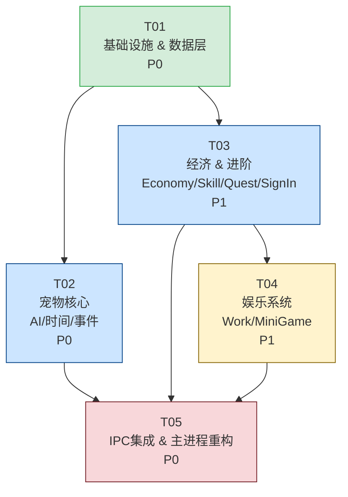
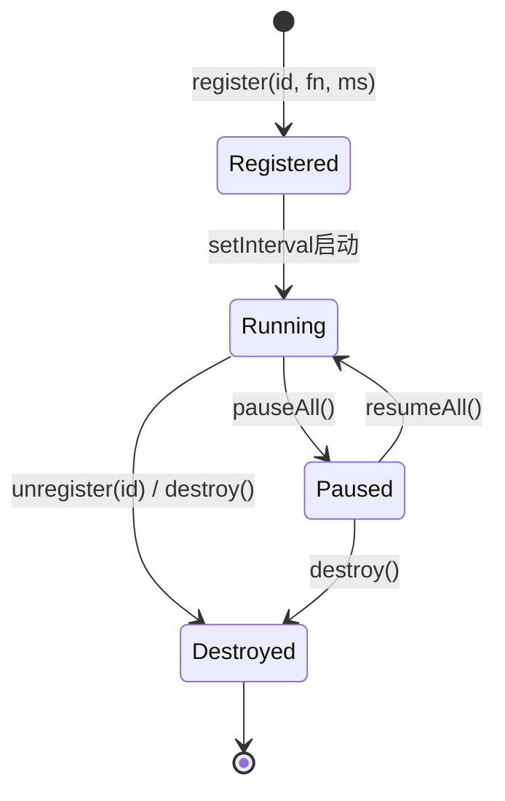

# 爪爪桌宠 · 后端系统架构设计文档

> 架构师：高见远（Bob）  
> 版本：v1.0  
> 日期：2025-05-30  
> 项目路径：`D:\workbuddy\2026-05-30-11-30-24\desktop-pet\`

---

## 目录

1. [完整文件列表](#1-完整文件列表)
2. [数据库 ER 图](#2-数据库-er-图)
3. [类依赖图](#3-类依赖图)
4. [IPC 通信表](#4-ipc-通信表)
5. [实现顺序任务列表](#5-实现顺序任务列表)
6. [依赖包列表](#6-依赖包列表)
7. [共享约定](#7-共享约定)
8. [Timer 类设计](#8-timer-类设计)

---

## 1. 完整文件列表

```
desktop-pet/
├── main.js                          # 原主进程入口（保留，轻量化，委托给 src/main/index.js）
├── package.json                     # 新增 better-sqlite3 等依赖
│
├── src/
│   └── main/
│       ├── index.js                 # 主进程后端总入口（组装所有模块、生命周期管理）
│       ├── ipc-handlers.js          # 所有 IPC channel 注册中心
│       ├── database.js              # SQLite 连接 + WAL + 迁移管理器
│       ├── timer-manager.js         # 全局 Timer 池（可暂停/恢复/销毁）
│       ├── pet-ai.js                # 行为树 + 需求系统 + 情绪状态机
│       ├── time-manager.js          # 时间感知 + 节日检测
│       ├── event-manager.js         # 随机事件触发器（30+ 种事件）
│       ├── economy.js               # 三种货币 + 道具 + 背包 + 交易
│       ├── quest.js                 # 每日任务 + 成就系统
│       ├── skill.js                 # 9 种技能 + 熟练度 + 效果加成
│       ├── work.js                  # 打工系统（8 种工作 + 倒计时）
│       ├── sign-in.js               # 每日签到 + 连续奖励
│       ├── mini-game.js             # 4 个小游戏管理
│       └── save-manager.js          # 脏标记自动存档 + 异常恢复
│
├── migrations/
│   ├── 001_init.sql                 # 建表 DDL（12 张表）
│   ├── 002_add_skills.sql           # 技能表 + 熟练度列补丁
│   └── 003_add_events.sql           # 事件日志表 + 事件配置表
│
├── assets/                          # （已有，不动）
└── renderer/                        # （已有，不动）
```

---

## 2. 数据库 ER 图

```mermaid
erDiagram
    users {
        INTEGER id PK
        TEXT    username
        TEXT    avatar
        INTEGER created_at
        INTEGER last_active_at
    }

    pet_status {
        INTEGER id        PK
        INTEGER user_id   FK
        INTEGER hunger        "饱食度 0-100"
        INTEGER cleanliness   "清洁度 0-100"
        INTEGER mood          "心情值 0-100"
        INTEGER stamina       "体力值 0-100"
        INTEGER exp
        INTEGER level
        INTEGER gold          "金币"
        INTEGER diamond       "钻石"
        INTEGER affinity      "好感币"
        TEXT    emotion_state "idle/happy/sad/excited/sleepy/angry"
        INTEGER updated_at
    }

    pet_skills {
        INTEGER id         PK
        INTEGER user_id    FK
        TEXT    skill_id   "unique skill key"
        INTEGER level
        INTEGER proficiency "当前熟练度"
        INTEGER max_proficiency "升级所需熟练度"
        INTEGER unlocked_at
    }

    inventory {
        INTEGER id       PK
        INTEGER user_id  FK
        TEXT    item_id
        TEXT    item_type "food/accessory/consumable/gift"
        INTEGER quantity
        INTEGER acquired_at
    }

    equipped {
        INTEGER id       PK
        INTEGER user_id  FK
        TEXT    slot     "head/body/accessory"
        TEXT    item_id
        INTEGER equipped_at
    }

    daily_tasks {
        INTEGER id          PK
        INTEGER user_id     FK
        TEXT    task_id
        TEXT    task_type   "interact/feed/play/work/signin"
        TEXT    description
        INTEGER target
        INTEGER progress
        INTEGER reward_gold
        INTEGER reward_exp
        INTEGER completed_at "NULL=未完成"
        INTEGER date        "YYYYMMDD"
    }

    achievements {
        INTEGER id           PK
        INTEGER user_id      FK
        TEXT    achievement_id
        TEXT    category
        TEXT    name
        TEXT    description
        INTEGER target
        INTEGER progress
        INTEGER reward_gold
        INTEGER reward_diamond
        INTEGER unlocked_at  "NULL=未解锁"
    }

    sign_in {
        INTEGER id         PK
        INTEGER user_id    FK
        INTEGER date       "YYYYMMDD"
        INTEGER streak     "连续签到天数"
        INTEGER reward_gold
        INTEGER reward_exp
        INTEGER created_at
    }

    friends {
        INTEGER id          PK
        INTEGER user_id     FK
        INTEGER friend_id   FK
        INTEGER affinity
        INTEGER last_interact_at
    }

    game_records {
        INTEGER id         PK
        INTEGER user_id    FK
        TEXT    game_id    "puzzle/memory/rhythm/idle"
        INTEGER score
        INTEGER duration
        INTEGER reward_gold
        INTEGER played_at
    }

    work_records {
        INTEGER id          PK
        INTEGER user_id     FK
        TEXT    work_id
        INTEGER started_at
        INTEGER finished_at
        INTEGER duration_sec
        INTEGER reward_gold
        INTEGER reward_exp
        INTEGER status      "pending/done/cancelled"
    }

    event_log {
        INTEGER id         PK
        INTEGER user_id    FK
        TEXT    event_id
        TEXT    event_type
        TEXT    payload     "JSON string"
        INTEGER triggered_at
    }

    users       ||--o{ pet_status    : "has"
    users       ||--o{ pet_skills    : "owns"
    users       ||--o{ inventory     : "carries"
    users       ||--o{ equipped      : "wears"
    users       ||--o{ daily_tasks   : "has"
    users       ||--o{ achievements  : "earns"
    users       ||--o{ sign_in       : "records"
    users       ||--o{ friends       : "befriends"
    users       ||--o{ game_records  : "plays"
    users       ||--o{ work_records  : "works"
    users       ||--o{ event_log     : "experiences"
```



---

## 3. 类依赖图

```mermaid
classDiagram
    direction TB

    class Database {
        -db : BetterSqlite3.Database
        -migrationsPath : string
        +constructor(dbPath)
        +initialize() void
        +runMigrations() void
        +prepare(sql) Statement
        +transaction(fn) Function
        +close() void
    }

    class TimerManager {
        -timers : Map~string, TimerEntry~
        -paused : boolean
        +constructor()
        +register(id, fn, intervalMs, options) void
        +unregister(id) void
        +pauseAll() void
        +resumeAll() void
        +destroy() void
        -tick(id, entry) void
    }

    class SaveManager {
        -db : Database
        -dirty : Set~string~
        -saveTimer : TimerManager
        +constructor(db, timerManager)
        +markDirty(module) void
        +forceSave() void
        -autoSave() void
        +recover() void
    }

    class TimeManager {
        -holidays : Map~string, string~
        +constructor()
        +getCurrentPeriod() string
        +getTodayHoliday() string|null
        +isWorkHours() boolean
        +getNextPeriodChange() number
    }

    class PetAI {
        -db : Database
        -timerManager : TimerManager
        -saveManager : SaveManager
        -eventEmitter : EventEmitter
        -userId : number
        -status : PetStatusVO
        -emotionState : string
        -behaviorTree : BehaviorNode
        +constructor(db, timerManager, saveManager, emitter)
        +initialize(userId) void
        +tick() void
        +applyDecay() void
        +feed(itemId) Result
        +clean() Result
        +interact(type) Result
        +getStatus() PetStatusVO
        -evaluateBehaviorTree() string
        -transitionEmotion(newState) void
    }

    class EventManager {
        -db : Database
        -petAI : PetAI
        -timerManager : TimerManager
        -eventEmitter : EventEmitter
        -userId : number
        -EVENT_POOL : EventDef[]
        +constructor(db, petAI, timerManager, emitter)
        +initialize(userId) void
        +scheduleRandomCheck() void
        -triggerEvent(eventDef) void
        +getEventLog(limit) EventRecord[]
    }

    class Economy {
        -db : Database
        -saveManager : SaveManager
        -userId : number
        -stmts : PreparedStatements
        +constructor(db, saveManager)
        +initialize(userId) void
        +getWallet() WalletVO
        +addGold(amount, reason) void
        +spendGold(amount, reason) boolean
        +addDiamond(amount, reason) void
        +spendDiamond(amount, reason) boolean
        +addAffinity(amount) void
        +getInventory() InventoryItem[]
        +addItem(itemId, qty) void
        +useItem(itemId) UseItemResult
        +equipItem(itemId, slot) boolean
        +getEquipped() EquippedVO
    }

    class QuestSystem {
        -db : Database
        -economy : Economy
        -saveManager : SaveManager
        -userId : number
        +constructor(db, economy, saveManager)
        +initialize(userId) void
        +getDailyTasks() DailyTask[]
        +refreshDailyTasks() void
        +updateTaskProgress(taskType, delta) void
        +getAchievements() Achievement[]
        +updateAchievement(achievementId, progress) void
        +claimReward(taskId) ClaimResult
    }

    class SkillSystem {
        -db : Database
        -economy : Economy
        -saveManager : SaveManager
        -userId : number
        -SKILL_DEFS : SkillDef[]
        +constructor(db, economy, saveManager)
        +initialize(userId) void
        +getSkills() PetSkill[]
        +addProficiency(skillId, amount) void
        +getEffectBonus(effectType) number
        -checkLevelUp(skillId) void
    }

    class WorkSystem {
        -db : Database
        -economy : Economy
        -timerManager : TimerManager
        -eventEmitter : EventEmitter
        -userId : number
        -activeWork : WorkRecord|null
        +constructor(db, economy, timerManager, emitter)
        +initialize(userId) void
        +startWork(workId) StartWorkResult
        +cancelWork() void
        +getActiveWork() WorkRecord|null
        +getWorkHistory(limit) WorkRecord[]
        -settle(workId) SettleResult
    }

    class SignInSystem {
        -db : Database
        -economy : Economy
        -userId : number
        +constructor(db, economy)
        +initialize(userId) void
        +signIn() SignInResult
        +getStreak() number
        +getHistory(days) SignInRecord[]
        +hasSignedInToday() boolean
    }

    class MiniGameManager {
        -db : Database
        -economy : Economy
        -userId : number
        -GAME_CONFIGS : GameConfig[]
        +constructor(db, economy)
        +initialize(userId) void
        +getGames() GameConfig[]
        +startGame(gameId) StartGameResult
        +submitScore(gameId, score, duration) ScoreResult
        +getLeaderboard(gameId) ScoreRecord[]
    }

    class IpcHandlers {
        -petAI : PetAI
        -economy : Economy
        -questSystem : QuestSystem
        -skillSystem : SkillSystem
        -workSystem : WorkSystem
        -signInSystem : SignInSystem
        -miniGameManager : MiniGameManager
        -eventManager : EventManager
        -timeManager : TimeManager
        -saveManager : SaveManager
        -mainWindow : BrowserWindow
        +constructor(modules, mainWindow)
        +registerAll() void
        -handle(channel, handler) void
        -push(event, data) void
    }

    class MainProcess {
        -database : Database
        -timerManager : TimerManager
        -saveManager : SaveManager
        -petAI : PetAI
        -economy : Economy
        -questSystem : QuestSystem
        -skillSystem : SkillSystem
        -workSystem : WorkSystem
        -signInSystem : SignInSystem
        -miniGameManager : MiniGameManager
        -eventManager : EventManager
        -timeManager : TimeManager
        -ipcHandlers : IpcHandlers
        +bootstrap(mainWindow) Promise~void~
        +shutdown() void
    }

    %% ── 依赖关系 ──
    MainProcess --> Database
    MainProcess --> TimerManager
    MainProcess --> SaveManager
    MainProcess --> PetAI
    MainProcess --> Economy
    MainProcess --> QuestSystem
    MainProcess --> SkillSystem
    MainProcess --> WorkSystem
    MainProcess --> SignInSystem
    MainProcess --> MiniGameManager
    MainProcess --> EventManager
    MainProcess --> TimeManager
    MainProcess --> IpcHandlers

    SaveManager --> Database
    SaveManager --> TimerManager

    PetAI --> Database
    PetAI --> TimerManager
    PetAI --> SaveManager

    EventManager --> Database
    EventManager --> PetAI
    EventManager --> TimerManager

    Economy --> Database
    Economy --> SaveManager

    QuestSystem --> Database
    QuestSystem --> Economy
    QuestSystem --> SaveManager

    SkillSystem --> Database
    SkillSystem --> Economy
    SkillSystem --> SaveManager

    WorkSystem --> Database
    WorkSystem --> Economy
    WorkSystem --> TimerManager

    SignInSystem --> Database
    SignInSystem --> Economy

    MiniGameManager --> Database
    MiniGameManager --> Economy

    IpcHandlers --> PetAI
    IpcHandlers --> Economy
    IpcHandlers --> QuestSystem
    IpcHandlers --> SkillSystem
    IpcHandlers --> WorkSystem
    IpcHandlers --> SignInSystem
    IpcHandlers --> MiniGameManager
    IpcHandlers --> EventManager
    IpcHandlers --> TimeManager
    IpcHandlers --> SaveManager
```



---

## 4. IPC 通信表

> **消息格式约定**  
> 渲染进程 → 主进程：`ipcRenderer.invoke(channel, { payload, requestId })`  
> 主进程 → 渲染进程：`webContents.send(event, { type, data, timestamp })`

### 4.1 宠物状态（pet:*）

| Channel | 方向 | 发送方 | 接收方 | Payload | 返回值 |
|---------|------|--------|--------|---------|--------|
| `pet:getStatus` | invoke | Renderer | Main | `{ userId }` | `PetStatusVO` |
| `pet:feed` | invoke | Renderer | Main | `{ userId, itemId }` | `{ ok, statusDelta, message }` |
| `pet:clean` | invoke | Renderer | Main | `{ userId }` | `{ ok, statusDelta }` |
| `pet:interact` | invoke | Renderer | Main | `{ userId, type }` "pat/play/talk" | `{ ok, moodDelta, expGain }` |
| `pet:statusUpdate` | push | Main | Renderer | `{ status: PetStatusVO }` | — |
| `pet:emotionChange` | push | Main | Renderer | `{ from, to, reason }` | — |

### 4.2 经济/背包（economy:*）

| Channel | 方向 | 发送方 | 接收方 | Payload | 返回值 |
|---------|------|--------|--------|---------|--------|
| `economy:getWallet` | invoke | Renderer | Main | `{ userId }` | `WalletVO` |
| `economy:getInventory` | invoke | Renderer | Main | `{ userId }` | `InventoryItem[]` |
| `economy:useItem` | invoke | Renderer | Main | `{ userId, itemId }` | `UseItemResult` |
| `economy:equipItem` | invoke | Renderer | Main | `{ userId, itemId, slot }` | `{ ok, equipped }` |
| `economy:getEquipped` | invoke | Renderer | Main | `{ userId }` | `EquippedVO` |
| `economy:walletUpdate` | push | Main | Renderer | `{ wallet: WalletVO }` | — |

### 4.3 任务/成就（quest:*）

| Channel | 方向 | 发送方 | 接收方 | Payload | 返回值 |
|---------|------|--------|--------|---------|--------|
| `quest:getDailyTasks` | invoke | Renderer | Main | `{ userId }` | `DailyTask[]` |
| `quest:claimReward` | invoke | Renderer | Main | `{ userId, taskId }` | `ClaimResult` |
| `quest:getAchievements` | invoke | Renderer | Main | `{ userId }` | `Achievement[]` |
| `quest:taskProgress` | push | Main | Renderer | `{ taskId, progress, completed }` | — |
| `quest:achievementUnlocked` | push | Main | Renderer | `{ achievement: Achievement }` | — |

### 4.4 技能（skill:*）

| Channel | 方向 | 发送方 | 接收方 | Payload | 返回值 |
|---------|------|--------|--------|---------|--------|
| `skill:getSkills` | invoke | Renderer | Main | `{ userId }` | `PetSkill[]` |
| `skill:levelUp` | push | Main | Renderer | `{ skillId, newLevel }` | — |

### 4.5 打工（work:*）

| Channel | 方向 | 发送方 | 接收方 | Payload | 返回值 |
|---------|------|--------|--------|---------|--------|
| `work:getJobs` | invoke | Renderer | Main | `{}` | `WorkDef[]` |
| `work:start` | invoke | Renderer | Main | `{ userId, workId }` | `StartWorkResult` |
| `work:cancel` | invoke | Renderer | Main | `{ userId }` | `{ ok }` |
| `work:getActive` | invoke | Renderer | Main | `{ userId }` | `WorkRecord\|null` |
| `work:complete` | push | Main | Renderer | `{ result: SettleResult }` | — |
| `work:tick` | push | Main | Renderer | `{ remaining }` "剩余秒数" | — |

### 4.6 签到（signin:*）

| Channel | 方向 | 发送方 | 接收方 | Payload | 返回值 |
|---------|------|--------|--------|---------|--------|
| `signin:check` | invoke | Renderer | Main | `{ userId }` | `{ hasSignedIn, streak }` |
| `signin:doSignIn` | invoke | Renderer | Main | `{ userId }` | `SignInResult` |
| `signin:getHistory` | invoke | Renderer | Main | `{ userId, days }` | `SignInRecord[]` |

### 4.7 小游戏（game:*）

| Channel | 方向 | 发送方 | 接收方 | Payload | 返回值 |
|---------|------|--------|--------|---------|--------|
| `game:getGames` | invoke | Renderer | Main | `{}` | `GameConfig[]` |
| `game:start` | invoke | Renderer | Main | `{ userId, gameId }` | `StartGameResult` |
| `game:submitScore` | invoke | Renderer | Main | `{ userId, gameId, score, duration }` | `ScoreResult` |
| `game:leaderboard` | invoke | Renderer | Main | `{ gameId }` | `ScoreRecord[]` |

### 4.8 事件（event:*）

| Channel | 方向 | 发送方 | 接收方 | Payload | 返回值 |
|---------|------|--------|--------|---------|--------|
| `event:getLog` | invoke | Renderer | Main | `{ userId, limit }` | `EventRecord[]` |
| `event:triggered` | push | Main | Renderer | `{ event: EventRecord }` | — |

### 4.9 时间/系统（system:*）

| Channel | 方向 | 发送方 | 接收方 | Payload | 返回值 |
|---------|------|--------|--------|---------|--------|
| `system:getTime` | invoke | Renderer | Main | `{}` | `{ period, holiday, timestamp }` |
| `system:forceSave` | invoke | Renderer | Main | `{ userId }` | `{ ok }` |
| `system:periodChange` | push | Main | Renderer | `{ period }` | — |

---

## 5. 实现顺序任务列表

> 遵循"先基础设施，后业务模块，最后集成"原则。  
> **最多 5 个任务**，每个任务涵盖一组高内聚文件。

### T01 · 项目基础设施 & 数据层

**优先级**：P0  
**依赖**：无  
**涵盖文件**：

```
package.json                 （新增 better-sqlite3 等依赖）
migrations/001_init.sql
migrations/002_add_skills.sql
migrations/003_add_events.sql
src/main/database.js
src/main/timer-manager.js
src/main/save-manager.js
```

**实现要点**：
- `package.json` 追加 `better-sqlite3`、`electron-rebuild`
- 三个迁移文件写好完整 DDL，含索引和触发器
- `Database` 类：WAL 模式、`PRAGMA journal_mode=WAL`、自动运行迁移、导出 `prepare()`/`transaction()`
- `TimerManager`：内部用 `setInterval`；`pauseAll` 记录暂停时刻，`resumeAll` 重新注册；`destroy` 清空所有 interval
- `SaveManager`：脏标记 Set，每 30 秒 `autoSave`，shutdown 时 `forceSave`

---

### T02 · 宠物核心（AI + 时间 + 事件）

**优先级**：P0  
**依赖**：T01  
**涵盖文件**：

```
src/main/pet-ai.js
src/main/time-manager.js
src/main/event-manager.js
```

**实现要点**：
- `PetAI`：
  - 4 个属性（hunger/cleanliness/mood/stamina），每分钟衰减（hunger -1, cleanliness -0.5, stamina -0.8 基准值）
  - 行为树节点类型：`Sequence / Selector / Condition / Action`
  - 情绪状态机：7 种状态，转移条件基于属性阈值
  - 每 3 秒 `tick()`，通过 EventEmitter 推送 `pet:statusUpdate`
- `TimeManager`：
  - 时段：`sleep(0-6)` / `morning(6-9)` / `work(9-12)` / `lunch(12-14)` / `afternoon(14-18)` / `evening(18-22)` / `night(22-24)`
  - 节日表：元旦/春节/情人节/清明/劳动/端午/七夕/中秋/国庆/圣诞（共10个）
- `EventManager`：
  - 每 15 分钟检查一次，30% 概率触发
  - 事件分类：随机礼物 / 心情突变 / 小任务 / 属性 buff / 特殊对话

---

### T03 · 经济 & 进阶系统

**优先级**：P1  
**依赖**：T01  
**涵盖文件**：

```
src/main/economy.js
src/main/skill.js
src/main/quest.js
src/main/sign-in.js
```

**实现要点**：
- `Economy`：所有货币操作走事务；物品 useItem 委托给 PetAI 的对应方法；装备系统联动 equip 表
- `SkillSystem`：
  - 9 种技能：觅食/清洁/社交/学习/运动/音乐/料理/艺术/探索
  - 熟练度满额自动升级，最高 10 级
  - `getEffectBonus(effectType)` 返回乘数（如 `work_speed` 最高 1.5x）
- `QuestSystem`：
  - 每日 0 点自动刷新 5 个任务（需 `TimeManager` 触发）
  - 50+ 成就配置用静态数组声明
- `SignInSystem`：连续签到 1-7 天递增奖励，断签重置 streak

---

### T04 · 娱乐系统（打工 + 小游戏）

**优先级**：P1  
**依赖**：T01, T03  
**涵盖文件**：

```
src/main/work.js
src/main/mini-game.js
```

**实现要点**：
- `WorkSystem`：
  - 8 种工作配置：{ id, name, duration, baseGold, baseExp, requiredStamina, skillBonus }
  - 打工期间 stamina 持续消耗；结算时 skill 熟练度 +
  - `TimerManager` 控制倒计时，每秒推送 `work:tick`
- `MiniGameManager`：
  - 4 个游戏：puzzle/memory/rhythm/idle-clicker
  - 游戏仅在主进程管理元数据（配置、记录、排行），具体玩法逻辑在渲染进程
  - `submitScore` 时根据分数段发放奖励

---

### T05 · IPC 集成 & 主进程重构

**优先级**：P0  
**依赖**：T01, T02, T03, T04  
**涵盖文件**：

```
src/main/ipc-handlers.js
src/main/index.js
main.js                      （重构：委托给 src/main/index.js）
```

**实现要点**：
- `IpcHandlers.registerAll()` 按模块分组注册所有 channel
- 统一错误处理：try/catch 包裹每个 handler，异常返回 `{ ok: false, error: message }`
- `MainProcess.bootstrap(mainWindow)` 按以下顺序初始化：
  1. Database → TimerManager → SaveManager
  2. TimeManager（无依赖）
  3. Economy → PetAI（并行初始化）
  4. QuestSystem → SkillSystem → SignInSystem（依赖 Economy）
  5. WorkSystem → MiniGameManager（依赖 Economy）
  6. EventManager（依赖 PetAI）
  7. IpcHandlers.registerAll()
  8. 启动所有定时器
- `main.js` 改为：`require('./src/main/index').bootstrap(petWindow)`

---

### 任务依赖图



---

## 6. 依赖包列表

```json
{
  "dependencies": {
    "better-sqlite3": "^9.4.3",
    "electron-store": "^8.1.0"
  },
  "devDependencies": {
    "electron": "^28.0.0",
    "@electron/rebuild": "^3.6.0"
  }
}
```

| 包名 | 版本 | 用途 |
|------|------|------|
| `better-sqlite3` | ^9.4.3 | 同步 SQLite 驱动，支持 WAL，性能最优 |
| `@electron/rebuild` | ^3.6.0 | 安装后需 rebuild native module 适配 Electron ABI |
| `electron-store` | ^8.1.0 | 已有，用于窗口位置等非结构化设置持久化 |

> ⚠️ **安装后必须执行**：  
> ```bash
> npm install
> npx electron-rebuild -f -w better-sqlite3
> ```

---

## 7. 共享约定

### 7.1 IPC 消息格式

```js
// 渲染进程发送（invoke）
const result = await window.electronAPI.invoke(channel, {
  payload: { ... },
  requestId: crypto.randomUUID()   // 渲染进程生成
});

// 主进程返回（统一结构）
return {
  ok: true,          // boolean
  data: { ... },     // 业务数据
  error: null,       // string | null，失败时有值
  requestId: '...'   // 原样透传
};

// 主进程主动推送（send）
webContents.send(eventName, {
  type: eventName,   // string
  data: { ... },
  timestamp: Date.now()
});
```

### 7.2 货币常量

```js
// src/main/economy.js 顶部导出
const CURRENCY = {
  GOLD:     'gold',
  DIAMOND:  'diamond',
  AFFINITY: 'affinity'
};
```

### 7.3 情绪状态枚举

```js
const EMOTION_STATE = {
  IDLE:    'idle',
  HAPPY:   'happy',
  SAD:     'sad',
  EXCITED: 'excited',
  SLEEPY:  'sleepy',
  ANGRY:   'angry',
  ANXIOUS: 'anxious'
};
```

### 7.4 时段枚举

```js
const TIME_PERIOD = {
  SLEEP:     'sleep',      // 0-6
  MORNING:   'morning',    // 6-9
  WORK:      'work',       // 9-12
  LUNCH:     'lunch',      // 12-14
  AFTERNOON: 'afternoon',  // 14-18
  EVENING:   'evening',    // 18-22
  NIGHT:     'night'       // 22-24
};
```

### 7.5 技能 ID 枚举

```js
const SKILL_ID = {
  FORAGING:  'foraging',   // 觅食
  CLEANING:  'cleaning',   // 清洁
  SOCIAL:    'social',     // 社交
  LEARNING:  'learning',   // 学习
  EXERCISE:  'exercise',   // 运动
  MUSIC:     'music',      // 音乐
  COOKING:   'cooking',    // 料理
  ART:       'art',        // 艺术
  EXPLORING: 'exploring'   // 探索
};
```

### 7.6 属性衰减基准值（每分钟）

```js
const DECAY_RATE = {
  hunger:       -1.0,   // 饱食度
  cleanliness:  -0.5,   // 清洁度
  mood:         -0.3,   // 心情（基准，受情绪修正）
  stamina:      -0.8    // 体力
};

// 睡眠时段修正系数
const PERIOD_DECAY_MODIFIER = {
  sleep:     0.3,   // 睡眠时衰减极慢
  morning:   0.8,
  work:      1.2,
  lunch:     0.6,
  afternoon: 1.0,
  evening:   0.9,
  night:     0.7
};
```

### 7.7 数据库文件路径约定

```js
// src/main/database.js
const { app } = require('electron');
const DB_PATH = path.join(app.getPath('userData'), 'pet-data.db');
const MIGRATIONS_PATH = path.join(__dirname, '../../migrations');
```

### 7.8 事务约定

- 所有多表写操作必须使用 `db.transaction(fn)()` 包裹
- 单表单行写操作可直接 `stmt.run()`
- **禁止**字符串拼接 SQL，全部使用 `db.prepare()` 预编译语句

---

## 8. Timer 类设计

### TimerEntry 数据结构

```js
/**
 * @typedef {Object} TimerEntry
 * @property {string}   id          - 唯一标识
 * @property {Function} fn          - 回调函数
 * @property {number}   intervalMs  - 触发间隔（毫秒）
 * @property {boolean}  immediate   - 首次注册时是否立即执行
 * @property {number|null} handle   - setInterval 返回的句柄，暂停时为 null
 * @property {number}   lastFired   - 上次触发的 Date.now()
 * @property {number}   callCount   - 累计触发次数
 */
```

### TimerManager 接口定义

```js
class TimerManager {
  /**
   * 注册一个定时器
   * @param {string}   id          - 唯一 key，重复注册会覆盖
   * @param {Function} fn          - 回调，无参数
   * @param {number}   intervalMs  - 间隔毫秒，最小 100ms
   * @param {{ immediate?: boolean }} options
   */
  register(id, fn, intervalMs, options = {}) {}

  /**
   * 注销定时器
   * @param {string} id
   */
  unregister(id) {}

  /**
   * 暂停所有定时器（记录暂停时刻，便于恢复时补偿）
   */
  pauseAll() {}

  /**
   * 恢复所有定时器
   * 恢复策略：若暂停时间 < intervalMs，使用 setTimeout 补偿剩余时间后再转 setInterval
   *           若暂停时间 >= intervalMs，立即触发一次再转 setInterval
   */
  resumeAll() {}

  /**
   * 销毁所有定时器（用于 app.quit 前清理）
   */
  destroy() {}

  /**
   * 获取所有已注册 timer 的状态快照（调试用）
   * @returns {Array<{ id, intervalMs, lastFired, callCount, paused }>}
   */
  getSnapshot() {}
}
```

### 预设定时器 ID 表

| Timer ID | 间隔 | 用途 | 注册方 |
|----------|------|------|--------|
| `pet.behaviorTick` | 3000ms | 行为树决策 | PetAI |
| `pet.decayTick` | 60000ms | 属性衰减 | PetAI |
| `event.randomCheck` | 900000ms | 随机事件（15分钟） | EventManager |
| `save.autoSave` | 30000ms | 脏标记自动存档 | SaveManager |
| `work.countdown` | 1000ms | 打工倒计时（动态注册/注销） | WorkSystem |
| `time.periodCheck` | 60000ms | 时段变更检测 | TimeManager |
| `quest.dailyReset` | 60000ms | 每日任务刷新检测 | QuestSystem |

### 定时器生命周期图



---

*文档结束 · 高见远（Bob）架构师 · 2025-05-30*
